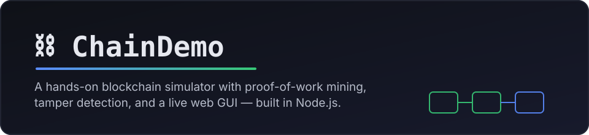
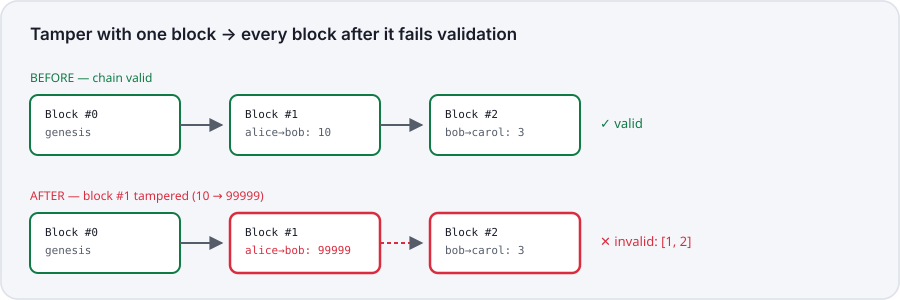

<div align="center">



### A hands-on **blockchain simulator** built with **Node.js, Express, and vanilla JavaScript**

Mine blocks with real proof-of-work · tamper with data and watch the chain break · learn how blockchains actually work by reading (and running) the code

[](LICENSE)
[](https://nodejs.org)
[](https://developer.mozilla.org/en-US/docs/Web/JavaScript)
[](#tech-stack)
[](#contributing)

[**Live Demo**](#quick-start) · [**Tutorial**](tutorial.html) · [**API Reference**](#api-reference) · [**FAQ**](#faq)

</div>

---

## What is ChainDemo?

**ChainDemo** is a small, self-contained **blockchain simulator with a browser-based GUI** —
built to make the core ideas behind blockchain technology (cryptographic hashing, block
chaining, proof-of-work mining, and tamper-evidence) tangible in a few minutes, instead of
abstract theory.

It's a great starting point if you're learning **how blockchain works**, teaching a
workshop, prepping for an interview, or just want a **Node.js blockchain example** you can
read end-to-end in one sitting. No cryptocurrency, no wallets, no blockchain network to
join — just the mechanics, laid bare, with a UI you can click through.

**In the app you can:**

- ✍️ **Add transactions** to a pending pool (`from`, `to`, `amount`)
- ⛏️ **Watch real proof-of-work mining happen live** — nonce by nonce, in your own browser, via a Web Worker, with a real-time hash-vs-target comparison and hashes/sec counter
- 🎚️ **Adjust mining difficulty** live and see how much longer mining takes per extra leading zero
- 🛠️ **Tamper with a mined block** and watch invalidity cascade to every block after it
- ✅ **Watch the chain get validated block-by-block**, with a live walkthrough showing exactly where (and from where onward) it breaks

<div align="center">

</div>

---

## Table of Contents

- [Why ChainDemo?](#why-chaindemo)
- [Quick Start](#quick-start)
- [How It Works](#how-it-works)
- [Using the GUI](#using-the-gui)
- [API Reference](#api-reference)
- [Project Structure](#project-structure)
- [Tech Stack](#tech-stack)
- [Testing](#testing)
- [FAQ](#faq)
- [Roadmap](#roadmap)
- [Contributing](#contributing)
- [License](#license)

---

## Why ChainDemo?

Most "learn blockchain" resources are either a wall of theory or a 10,000-line
cryptocurrency client. ChainDemo sits in between:

| | ChainDemo | Whitepapers & theory | Full crypto clients |
|---|---|---|---|
| Runs in your browser | ✅ | ❌ | Sometimes |
| Readable in one sitting | ✅ | Depends | ❌ |
| Real SHA-256 proof-of-work | ✅ | Described only | ✅ |
| Zero dependencies to learn | ✅ (just Express) | — | ❌ (wallets, P2P, consensus…) |
| Tamper-detection you can trigger yourself | ✅ | ❌ | Rarely exposed in the UI |

It's deliberately **not** a cryptocurrency: there are no wallets, private keys, signatures,
or peer-to-peer networking. That's on purpose — stripping those away is what makes the
core mechanism (hash → chain → proof-of-work → tamper-evidence) easy to see clearly.

## Quick Start

**Requirements:** [Node.js](https://nodejs.org) 18 or later.

```bash
git clone https://github.com/masghar/blockchain.git
cd blockchain
npm install
npm start
```

Then open **http://localhost:3000** in your browser.

Want the concepts explained alongside the code first? Open
**[tutorial.html](tutorial.html)** (or click "Tutorial" in the app's header).

## How It Works

Every block is hashed with SHA-256 over its own contents plus the previous block's hash —
that's the "chain" in blockchain. Mining searches for a `nonce` that makes the hash start
with N leading zeros (the difficulty) — and in this app, that search runs for real in your
own browser (a Web Worker with a hand-written, Node-crypto-verified SHA-256), not on the
server. The server never trusts the result blindly: it re-derives the hash itself before
accepting a mined block. Change any data in a mined block without re-mining it, and its
hash no longer matches its contents — and neither does the `previousHash` of every block
that follows, so the break cascades forward. That's tamper-evidence in action.

For the full walkthrough — with the actual `calculateHash()`, the live mining protocol, and
`isChainValid()` code from this repo — see **[tutorial.html](tutorial.html)**.

## Using the GUI

| Control | What it does |
|---|---|
| **Add Transaction** | Queues a `{ from, to, amount }` entry into the pending pool |
| **⛏ Start Mining** | Opens the live mining console — real proof-of-work running in your browser, with a live nonce, hash-vs-target comparison, attempts counter, and hashes/sec |
| **✕ Cancel** | Stops an in-progress mining run immediately |
| **Difficulty slider (1–5)** | Sets how many leading zeros the next mined block's hash must have — each extra zero roughly multiplies the search space by 16 |
| **Inline amount edit** | Tampers with a mined transaction directly, without re-mining — the fastest way to see detection in action |
| **✓ Validate Chain** | Walks the chain block-by-block with a visible pulse, then shows exactly where (and everything after where) it breaks |
| **Stats bar** | Chain length, total transactions, current difficulty, and a live validity badge |

## API Reference

ChainDemo exposes a small REST API (consumed by the bundled GUI, but usable from `curl`,
Postman, or your own frontend):

| Method | Path | Purpose |
|---|---|---|
| `GET` | `/api/chain` | Full chain |
| `GET` | `/api/pending` | Pending (unmined) transactions |
| `POST` | `/api/transactions` | Queue a transaction `{from, to, amount}` |
| `POST` | `/api/mine/start` | Get a mining template (index, timestamp, transactions, previousHash, difficulty) to mine against |
| `POST` | `/api/mine/submit` | Submit a found `{ timestamp, nonce, previousHash, transactions }` — server re-verifies and appends the block |
| `GET` | `/api/validate` | Check chain validity — returns `{ valid, invalidBlocks }` |
| `POST` | `/api/tamper` | Deliberately corrupt a block's transaction (demo only) |
| `GET` / `POST` | `/api/difficulty` | Read/set mining difficulty (clamped 1–5) |

<details>
<summary>Example: add a transaction and mine it (curl)</summary>

```bash
curl -X POST http://localhost:3000/api/transactions \
  -H "Content-Type: application/json" \
  -d '{"from":"alice","to":"bob","amount":10}'

curl -X POST http://localhost:3000/api/mine/start
# → mine a nonce against the returned template client-side, then:
# curl -X POST http://localhost:3000/api/mine/submit -d '{"timestamp":...,"nonce":...,"previousHash":"...","transactions":[...]}'
```

</details>

## Project Structure

```
blockchain.js               Core Block/Blockchain classes (framework-free, unit-testable)
server.js                   Express app: REST API + chain.json persistence + static file serving
public/                     Browser GUI — no build step
  index.html, styles.css, app.js   Page structure, styling, and UI logic
  sha256.js                 Hand-written SHA-256, tested against Node's crypto
  mining-input.js           Shared hash-input format used by both client and server
  miner-worker.js           Web Worker that mines live in the browser
tutorial.html               Standalone written walkthrough of the concepts and code
test/                       Unit tests (blockchain logic + client/server hash parity)
chain.json                  Generated at runtime; holds the persisted chain (git-ignored)
```

## Tech Stack

- **Backend:** [Node.js](https://nodejs.org) + [Express](https://expressjs.com)
- **Frontend:** Plain HTML, CSS, and JavaScript — no framework, no bundler, no build step
- **Hashing:** SHA-256 — server-side via Node's built-in [`crypto`](https://nodejs.org/api/crypto.html) module, and client-side (for live mining) via a hand-written implementation in `public/sha256.js`, cross-tested against Node's `crypto` for parity
- **Persistence:** A flat `chain.json` file (no database required)
- **Testing:** Node's built-in [`node:test`](https://nodejs.org/api/test.html) runner

## Testing

```bash
npm test
```

Runs the unit test suite in `test/blockchain.test.js`, covering hash chaining, mining
difficulty, cascading tamper detection, transaction validation, and JSON persistence
round-trips.

## FAQ

**Is this a real cryptocurrency or blockchain network?**
No. There are no wallets, private keys, digital signatures, or peer-to-peer networking.
ChainDemo runs as a single node and focuses purely on the data-structure and
hashing/mining mechanics that underpin real blockchains.

**What is proof-of-work, in one sentence?**
It's an artificial cost — search for a `nonce` value until a block's hash happens to start
with enough zeros — that makes creating a new block slow and rewriting old ones
prohibitively expensive.

**Why does tampering with one block break the blocks after it too?**
Because each block stores the previous block's hash. If you edit a block's data without
re-mining it, its own hash no longer matches its content, *and* every later block's
recorded `previousHash` no longer matches what that block truly hashes to now — so the
invalidity cascades forward through the whole chain.

**Can I increase the difficulty beyond 5?**
The API clamps difficulty to 1–5 so mining stays fast in a browser demo. You're welcome to
raise that limit locally in `blockchain.js` if you want to see mining take noticeably
longer.

**Does the chain survive a server restart?**
Yes — it's persisted to `chain.json` on disk after every mine/tamper/difficulty change, and
reloaded automatically on the next `npm start`.

**Why does mining happen in my browser instead of on the server?**
So you can actually watch it happen. The server hands out a mining template and your
browser searches for the nonce in a Web Worker, live, in the open — then the server
independently re-verifies the result before accepting it, so nothing is taken on trust.

## Roadmap

- [ ] Optional multi-node / peer-to-peer sync mode
- [ ] Wallet + digital signature layer (opt-in, keeping the current mode as default)
- [ ] Dockerfile for one-command deployment

Have an idea? Open an issue.

## Contributing

Contributions are welcome! To propose a change:

1. Fork the repo and create a branch: `git checkout -b my-feature`
2. Make your change and add/update tests in `test/`
3. Run `npm test` and make sure everything passes
4. Open a pull request describing what changed and why

## License

Released under the [MIT License](LICENSE) — free to use, modify, and learn from.

---

<div align="center">

If ChainDemo helped you understand blockchains a little better, consider ⭐ **starring the repo**.

</div>
